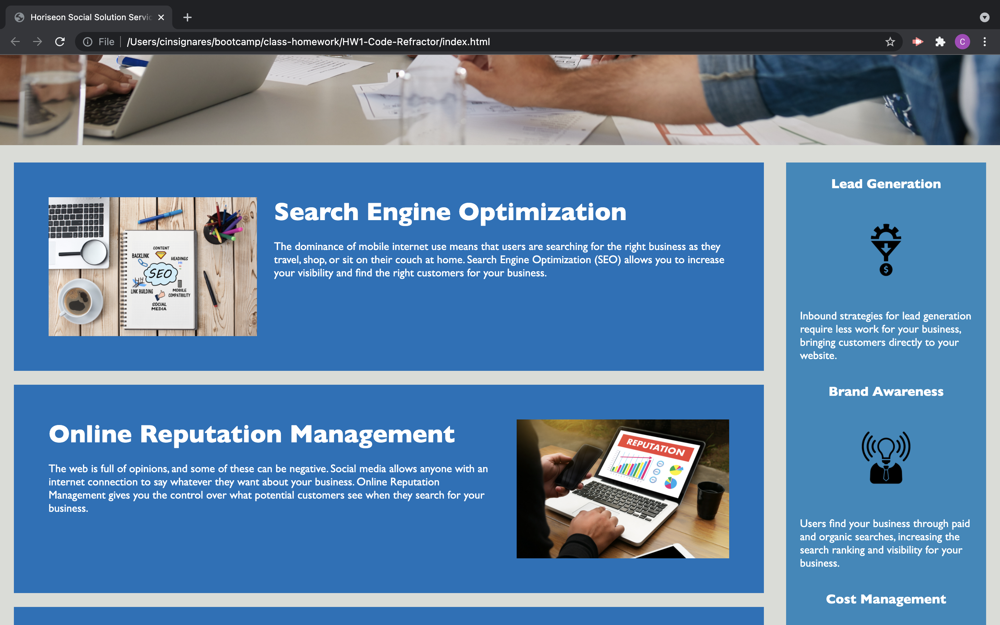
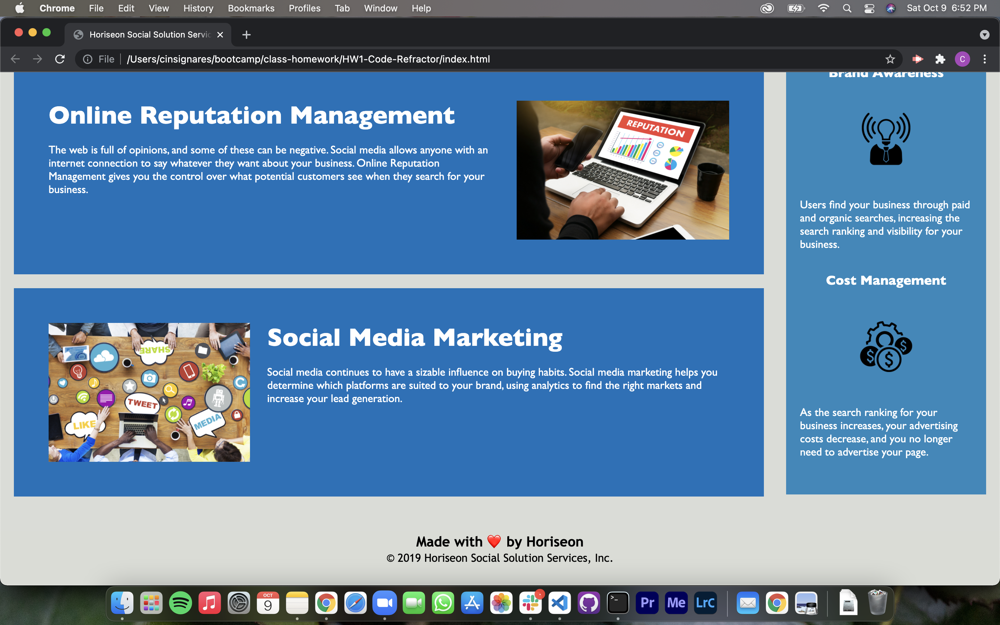

# <Code-Refractor>

## Updating code with semantic elements for Horiseon website

This project is meant to work on Horiseon website and alter the code to fit current semantic element practices. Code will be updated to function better with SEO standards.

